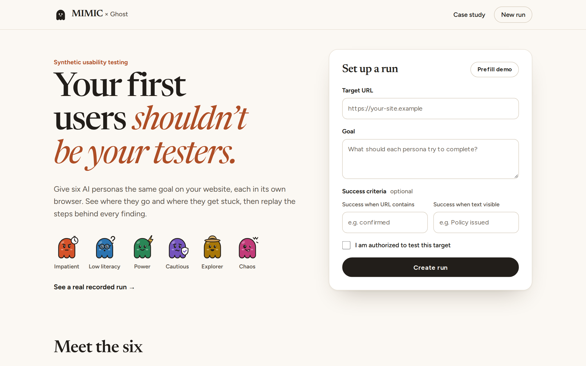
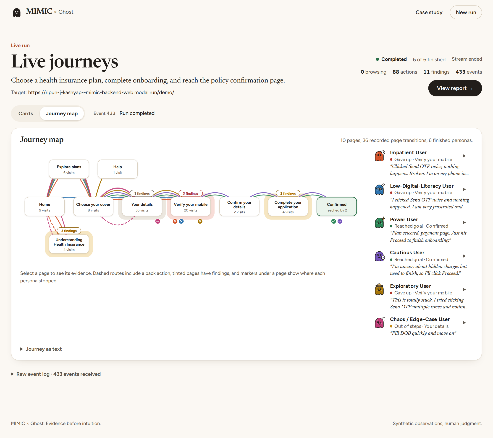
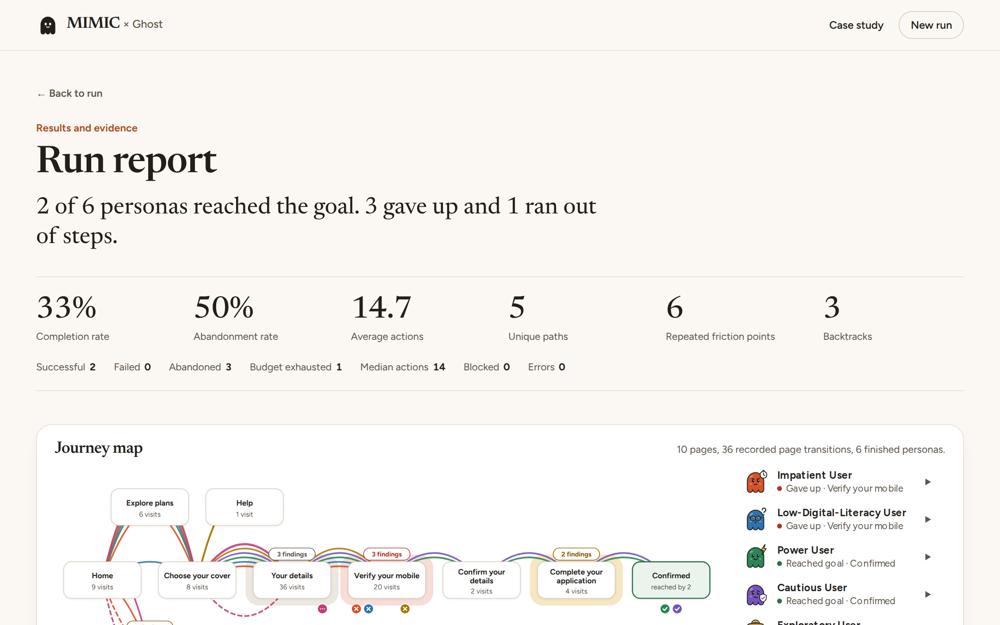
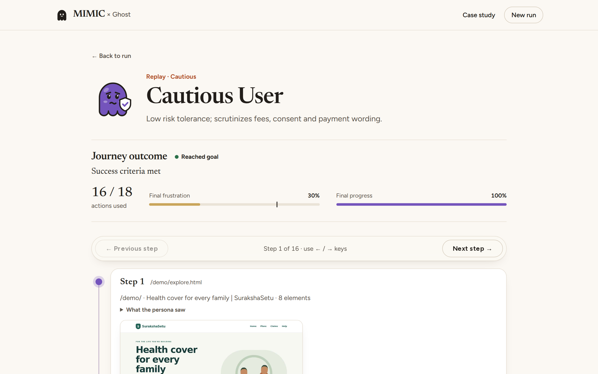
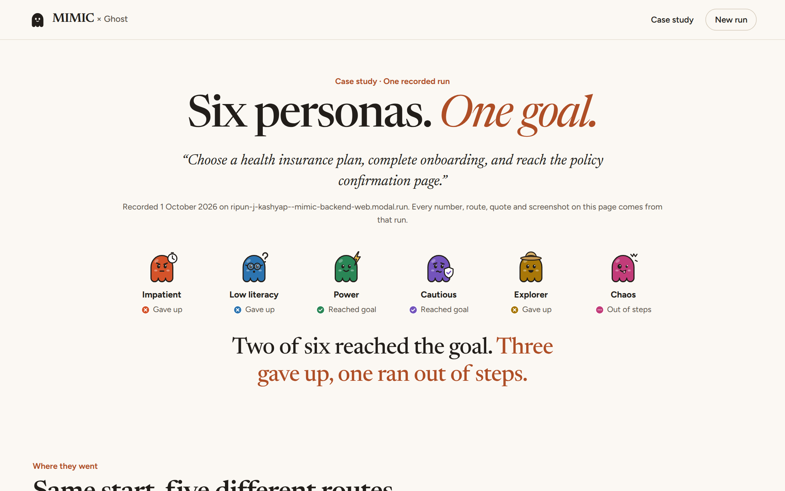
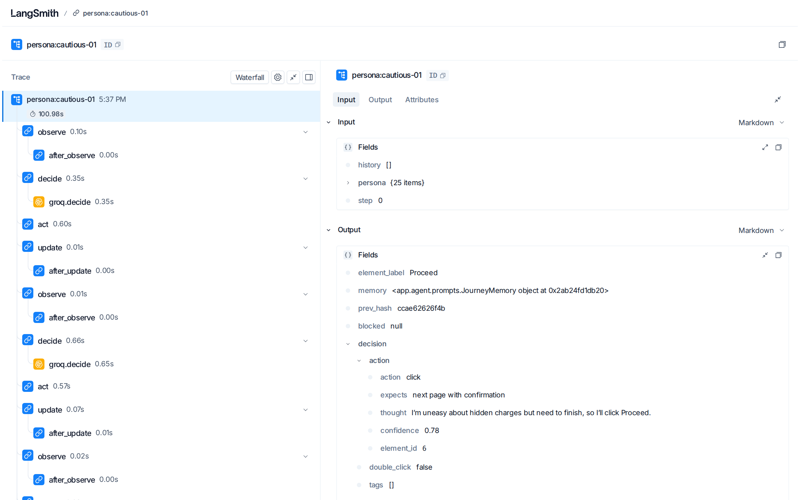

# MIMIC × Ghost

**Your first users shouldn’t be your testers.**

MIMIC sends six AI personas with different behaviours through your site and shows you where they got stuck, with the evidence.

| | |
|---|---|
| **Live app** | https://mimic-teal-one.vercel.app |
| **Case study** (one recorded run, told as a story) | https://mimic-teal-one.vercel.app/case-study |
| **API** (interactive docs at `/docs`) | https://ripun-j-kashyap--mimic-backend-web.modal.run |
| **Public agent trace** (LangSmith) | https://smith.langchain.com/public/2542d900-ca97-4bee-9373-2d65a8eaaa8d/r |



MIMIC is built for developers who want to see how different kinds of users experience their site before launch. Each persona gets its own isolated browser, its own state and the same goal ("buy a policy", "book an appointment"). They work in parallel, and MIMIC records every step, groups the friction they hit into evidence-backed findings, and lets you replay any persona's journey screen by screen.

It is for **authorized testing only**: your staging site, your own app, or a target you have explicit permission to test.

> MIMIC does not predict real human behaviour. It simulates controlled behavioural assumptions to surface usability problems worth investigating with real users.

---

## What it does

1. **Configure.** Enter a target URL and a goal, plus optional success criteria (such as "URL contains `confirmed`"), and confirm you are authorized to test it.
2. **Review the cohort.** Six personas, each with explicit traits, an action budget and a frustration threshold at which it gives up:

   | Persona | Behaviour enforced in code | Decision model |
   |---|---|---|
   | Impatient | Small budget, low patience, never waits, quits early when blocked | qwen3.8-27b (Groq) |
   | Low digital literacy | Only sees controls with visible text labels; error messages frustrate it more | Gemini 3.5 Flash-Lite |
   | Power user | Shortest path, no browsing; its path length shows wasted steps | qwen3.8-27b (Groq) |
   | Cautious | Must check fees and terms before committing on payment, OTP or consent pages | gpt-oss-120b (Groq) |
   | Explorer | Opens secondary paths and backtracks without frustration | Gemini 3.5 Flash-Lite |
   | Chaos | Edge-case inputs (`12345`, Devanagari digits, emoji…), double-clicks, going back mid-flow | gpt-oss-120b (Groq) |

3. **Deploy the swarm.** Six parallel Playwright browser contexts with no shared cookies or storage. Every step streams live to the UI over server-sent events, and a journey map draws each persona's route as it happens.
4. **Report.** Deterministic metrics (completion, abandonment, average and median actions, unique paths, backtracks) and findings split into **Observed → Evidence → Interpretation → Suggested investigation**. Interpretations written by a model are labelled as AI-written.
5. **Replay.** Step by step: what the persona saw (the exact text it was given), what it decided and why, what happened, how its state changed, and screenshots.



## Results from the recorded demo run

One run of the full cohort against our seeded demo site ([run report](https://mimic-teal-one.vercel.app/runs/327ebf9a-51ef-485f-b8f6-44d083a27d81/report)), recorded for the demo video:

| | |
|---|---|
| Run time | 2 min 54 s, six personas in parallel |
| Outcomes | 2 reached the goal (Power, Cautious) · 3 gave up (Impatient, Low literacy, Explorer) · 1 ran out of actions (Chaos) |
| Different routes taken | 5 |
| Findings | 11, each linked to the events and screenshots behind it |
| Seeded defects found | **6 of 12** (D2, D5, D6, D7, D9, D10) |
| Errors | 0 |

**The clearest signal:** three of the six personas gave up on the same page, the mobile OTP step, and all four that reached it hesitated there. That page has two seeded defects: the OTP arrives silently after three seconds, and the code is shown only in small footer text.

Across six scored real runs during development, MIMIC found between 42% and 83% of the seeded defects. Results vary from run to run because the agents are LLM-driven, which is also why every finding links back to its evidence.







## The agentic loop

```
observe page ──► compact text: headings, messages, numbered element menu
     │
reason as persona ──► LLM picks ONE action from the menu (JSON); it cannot invent selectors
     │
persona policy ──► code-enforced behaviour (chaos inputs, cautious checks, …)
     │
act ──► Playwright: click / type / select / scroll / back / wait
     │
update state ──► deterministic rules: frustration, progress, failed attempts, budget, journey memory
     │
continue │ success │ abandoned │ failed │ budget exhausted │ blocked by verification
```

**Code owns state, the LLM owns choices.** Counters, frustration, budgets and termination are plain Python. The model can't end its own journey by claiming "done": success is checked against the criteria. Each persona also keeps a short journey memory ("you already tried *Get Started* and came back"), so it doesn't loop on a dead end.

## Architecture

```
Next.js UI (Vercel) ──HTTPS + SSE──► FastAPI on Modal (one always-on container)
                                      ├─ Run orchestrator ── 6 × LangGraph persona loops
                                      ├─ Playwright: 1 Chromium, 6 isolated contexts
                                      ├─ Model router
                                      │    Groq (qwen3.8-27b, gpt-oss-120b) ─► decisions
                                      │    Gemini 3.5 Flash-Lite ──────────────► decisions + fallback
                                      │    Gemini 3.8 / 3.7 Flash ─────────────► screenshot reading, report wording
                                      ├─ Event bus ─► Supabase (runs, personas, events, findings, screenshots)
                                      ├─ Analysis: metrics + 13 friction detectors + clustering
                                      └─ Tracing ─► LangSmith
```

- **Visual escalation.** Screenshots go to Gemini only when the text view isn't enough (a persona is stuck, or the page has almost no controls). Each page is read at most once per run, at most four times per run, and the result is shared across personas.
- **Quota discipline.** Token-bucket rate limiting per model, spillover across models, and Gemini usage tracked per key and model (every request counts, including 503s).
- **Evidence first.** Findings come from deterministic detectors over stored events. The LLM only rewrites the interpretation text for findings that already exist; it cannot add findings or change evidence.

## Observability

Every persona run is a LangSmith trace: each LangGraph step (observe → decide → act → update) with every model call nested inside it, including the prompt the persona saw and the JSON decision it returned. API keys and raw screenshot bytes are filtered out before anything is sent.

[Open the public trace of the Cautious persona](https://smith.langchain.com/public/2542d900-ca97-4bee-9373-2d65a8eaaa8d/r), which reached the goal after the code made it check the fees first.



## Seeded demo target: SurakshaSetu

A fictional Indian health-insurance onboarding site (`backend/demo_site/`, served at [`/demo/`](https://ripun-j-kashyap--mimic-backend-web.modal.run/demo/)) with **13 documented usability defects** (`SEEDED_ISSUES.json`): similarly worded call-to-action buttons, a dead-end article, unexplained insurance jargon, a form that accepts a 5-digit mobile number, generic "Invalid input" errors, an OTP that arrives silently after 3 s with the code hidden in footer text, an unnecessary confirmation step, unexplained "applicable charges*", a pre-ticked data-sharing consent box, a double-click that charges twice, and a mobile layout that hides the call-to-action below the fold.

We test on a site we built so we can **measure** what MIMIC finds instead of only claiming it. `scripts/evaluate_run.py` scores a run's findings against this ground truth (12 defects are detectable from text and behaviour; the 13th is visual only).

## API

| Method | Path | Purpose |
|---|---|---|
| `POST` | `/runs` | Create a run (target URL, goal, success criteria, `authorized: true`) |
| `POST` | `/runs/{id}/start` | Deploy the swarm |
| `GET` | `/runs/{id}` | Run status and live persona states |
| `GET` | `/runs/{id}/events` | Server-sent event stream (resumes with `Last-Event-ID`) |
| `GET` | `/runs/{id}/report` | Metrics and findings |
| `GET` | `/runs/{id}/personas/{pid}/journey` | One persona's full journey with screenshot links |
| `GET` | `/runs/golden` | The recorded demo run |
| `GET` | `/health`, `/health/quota` | Readiness and remaining model quota |

## Safety

- An authorization checkbox is required for every run. Private, loopback and link-local targets are rejected (SSRF guard).
- Navigation is fenced to the target host. Irreversible actions ("Pay now", "Delete") are blocked on any target except our own demo site.
- CAPTCHA and Cloudflare challenges end the persona as `blocked_by_verification`. **There is no bypass.**
- Per-IP and global rate limits on starting runs. API keys live only in server-side environment variables.

## Run locally

```bash
# backend (Python 3.12)
cd backend
uv venv --python 3.12 .venv && uv pip install -r requirements-dev.txt --python .venv/bin/python
.venv/bin/playwright install chromium
cp .env.example .env            # add Groq / Gemini / Supabase keys (LangSmith optional)
LLM_MODE=fake GEMINI_MODE=fake .venv/bin/uvicorn app.main:app --port 8000   # fake = scripted decisions, zero quota

# frontend
cd ../frontend && npm install
NEXT_PUBLIC_API_URL=http://localhost:8000 npm run build && npx next start
```

Apply `backend/app/db/migrations/001_init.sql` in Supabase. Tests: `cd backend && .venv/bin/pytest -q`.

## Deploy

- Backend: `cd backend && .venv/bin/modal deploy modal_app.py` (secrets are read from `backend/.env` at deploy time).
- Frontend: Vercel, root directory `frontend`, with `NEXT_PUBLIC_API_URL` set to the Modal URL.
- Before a demo: `bash backend/scripts/prewarm.sh`.

## What we claim, and what we don't

✅ Autonomous synthetic users can explore live product journeys. Different controlled behavioural policies produce different trajectories. Repeated friction can be detected across independent sessions. Every finding is replayable evidence.

❌ It does not predict exact human behaviour, does not replace user research, does not simulate demographic groups, does not guarantee every issue is found, and must not be used on sites you aren't authorized to test.

## Stack

Next.js 16 · FastAPI · LangGraph · Playwright · Groq (qwen3.8-27b, gpt-oss-120b) · Gemini (3.8 / 3.7 Flash, 3.5 Flash-Lite) · Supabase · Modal · Vercel · LangSmith
